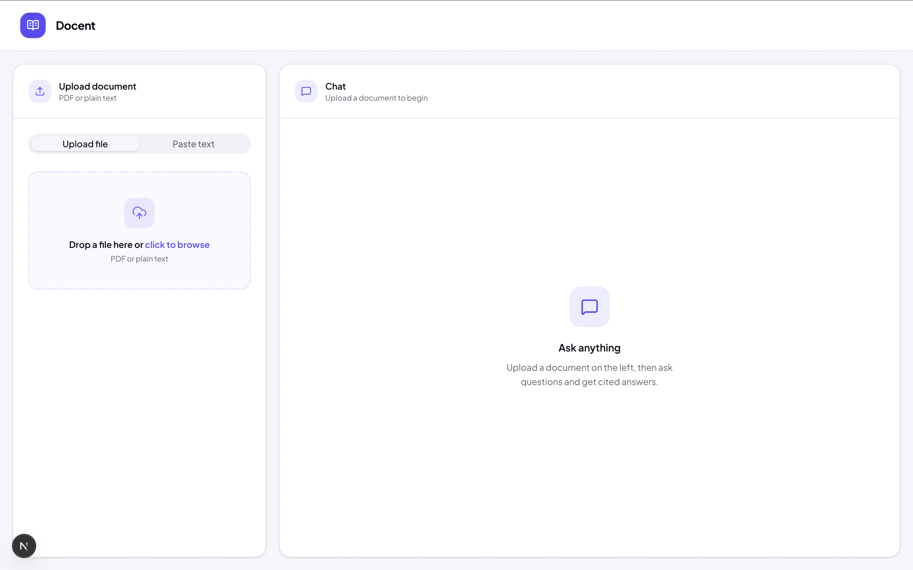

# Docent Labs

A web app that lets you upload a document and have a conversation with it. Upload a PDF or paste in some text, and the app will process it so you can ask questions and get answers based on the content. Allows you to see exactly what is being referenced when an answer is given.

---

## What It Does

**Upload a document.** Drag and drop a PDF onto the upload area, or switch to the text tab and paste content directly. The app accepts PDF files up to 20MB. If you have content that is not in a PDF, the text input lets you paste anything from a Word doc, a website, or plain notes.

**Wait for processing.** Once uploaded, the app reads through the document and breaks it into sections that can be searched later. A status indicator on the page updates as this happens, so you know when the document is ready without having to refresh or guess.

**Ask questions.** Type a question in the chat box and the app searches through the document to find the sections most relevant to what you asked. It then uses those sections to put together an answer, which streams back to you word by word as it is being written.

**See where the answer came from.** Every response includes source citations that show which part of the document the answer was based on. You can expand each citation to read the original passage. This means you can verify anything the app tells you and trace it back to the source in seconds.

---

## Real World Use Cases

**Example: Turning Internal Documentation Into a Resource**

Any team that relies on internal documentation can use this tool to make that knowledge faster to access. Instead of digging through folders or asking a colleague, employees can ask a question and get a direct answer with references back to the source material.

Use case: A paid media manager is onboarding a new client and needs to build a campaign strategy. Normally, they would spend time re-reading the agency's internal playbooks, past campaign reports, and the client's brief to piece together a plan.

With Docent, they can upload all of that at once: the agency's paid ads protocol, brand guidelines, previous performance reports, and the client brief. Then they can ask questions like:

1. "What is our standard approach for a brand awareness campaign with a small budget?"
2. "What does the client brief say about their target audience?"
3. "How have we handled similar clients in the past?"

Docent will pull together answers from the uploaded documents and cite exactly which document and section each point came from. The employee gets a grounded, referenced response in seconds rather than spending time searching through files manually. This applies equally to any team that works with documents: legal, HR, sales, or any role where the answer is somewhere in the files but finding it takes too long.

**Example: Student Exam Prep**

Any learner, no matter their age can use this tool to make sure that they are studying material the way it has been taught by their professors, and avoid the common trap of general AI explanations. Docent AI makes sure that all it's answers are based on the given lecture notes, and not the general definitions and replies that it has been trained on.

Use case: A student has an exam coming up and has spent the semester building up a set of lecture notes. The problem with using a general AI tool to study is that it will answer from its own knowledge, which may not match what the professor taught or how the course framed a topic.

With Docent, the student uploads their own notes and studies from those. They can ask questions like:

1. "Explain the key argument from week 4 on market competition."
2. "Quiz me on the main concepts from chapter 3."
3. "What did my notes say about the causes of the 2008 financial crisis?"

Every answer Docent gives is pulled directly from the uploaded notes, with citations showing exactly where the information came from. The student is not getting a generic textbook answer. They are being answered with their own material, in the way their course covered it. This keeps studying focused and makes sure nothing outside the course content sneaks in.

---

## Features

- Drag-and-drop PDF upload or plain text input
- Real-time processing status updates
- Streaming chat responses
- Source citations with expandable chunk previews
- Clean single-page layout

---

## Tech Stack

| Layer | Technology |
|---|---|
| Framework | Next.js 15, React 19 |
| Styling | Tailwind CSS |
| Backend | FastAPI (Python) |
| Testing | Vitest, React Testing Library |

---

## Additional Docs

- [Quickstart](documentation/quickstart.md)
- [Directory Structure](documentation/filestructure.md)
